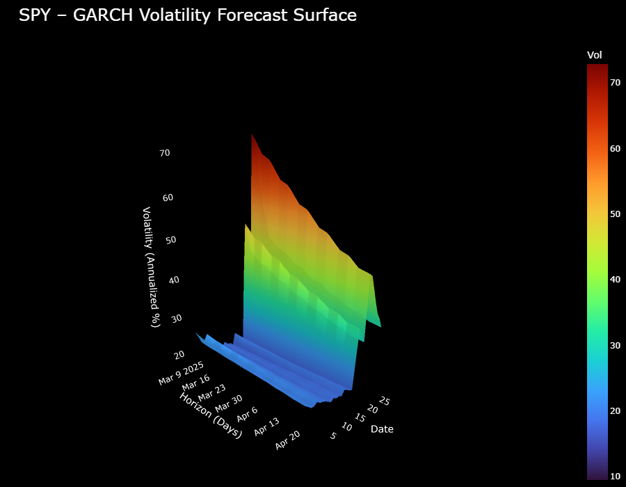

## GARCH Volatility Surface Modeling

Using historical stock price data, I fit a GARCH model to daily returns to estimate conditional volatility and capture key market features such as volatility clustering, persistence, and mean reversion. I then generate multi-horizon volatility forecasts and visualize them as an interactive 3D surface using Plotly. This surface shows how volatility reacts to shocks and gradually decays across future horizons, providing an intuitive view of volatility regimes.

---

## What is GARCH?

GARCH (Generalized Autoregressive Conditional Heteroskedasticity) is a time-series model used to estimate and forecast volatility. Unlike rolling standard deviations, GARCH treats volatility as a dynamic process that depends on both recent return shocks and past volatility levels.

In a GARCH(1,1) model, conditional variance is updated as:

sigma_t^2 = omega
+ alpha * (return_{t-1})^2
+ beta * sigma_{t-1}^2

This structure allows the model to react to sudden market shocks while maintaining persistence over time, which closely matches observed market behavior.

---

## What This Project Does

- Computes log returns from historical equity price data  
- Fits a GARCH(1,1) model to estimate conditional volatility  
- Generates multi-day volatility forecasts across different horizons  
- Visualizes forecasted volatility as an interactive 3D surface  

The resulting volatility surface highlights how market shocks propagate forward in time and how volatility gradually mean-reverts at longer horizons.

---

## Example Output

The primary output of this project is an interactive 3D volatility surface where:

- One axis represents the forecast horizon (days ahead)  
- One axis represents time  
- Surface height and color represent forecasted volatility  

This visualization provides a clearer understanding of volatility dynamics than traditional 2D plots.

---

## Why This Matters

Volatility modeling plays a central role in risk management, derivatives pricing, and quantitative trading. By visualizing volatility across both time and horizons, this project demonstrates how GARCH models capture real market behavior and provides a foundation for more advanced applications such as options pricing and probabilistic forecasting.
